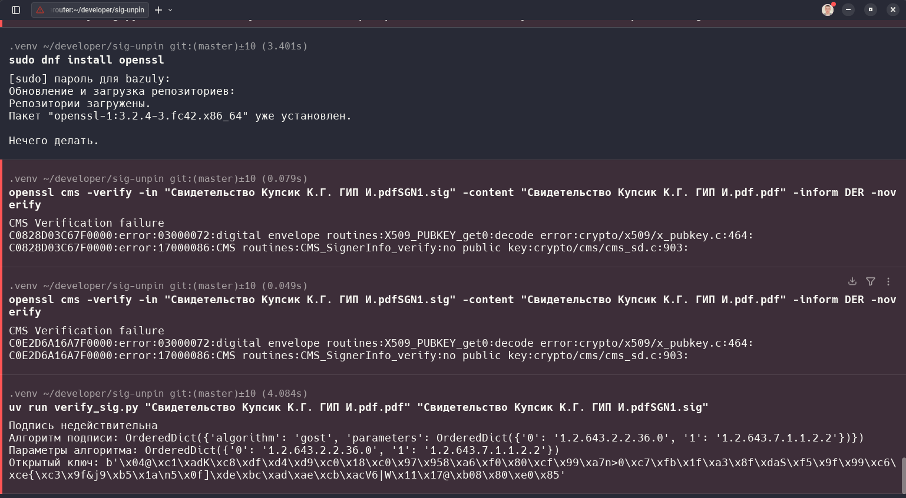

Вы можете запустить скрипт одним из следующих способов:

С использованием uv (современный способ)
uv run verify_sig.py "Свидетельство Купсик К.Г. ГИП И.pdf.pdf" "Свидетельство Купсик К.Г. ГИП И.pdfSGN1.sig"

Традиционный способ с Python
python3 verify_sig.py "Свидетельство Купсик К.Г. ГИП И.pdf.pdf" "Свидетельство Купсик К.Г. ГИП И.pdfSGN1.sig"

⚠️ Важные замечания

    Требования к окружению:

        Необходимо использовать приложенные файлы окружения

        Библиотека pygost требует специальной настройки, так как официально не поддерживает все необходимые алгоритмы

    Модификации кода:
    # Были внесены изменения для поддержки ГОСТ алгоритмов
    # на основе решения из: https://github.com/wbond/asn1crypto/issues/120

Результаты тестирования:

    Скрипт показал, что подпись недействительна

    Результат подтвержден проверкой через OpenSSL

Решение тестировалось на Fedora linux, на Ubunte также запустится без проблем.